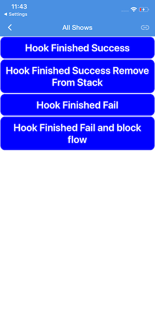

# PreHookExample-RN

## Requirements
- node >= 8.1.4
- npm = 5.0.4

## How to run the project:
- `npm install -g react-native@0.47.1`
- `npm install`
- `npm login`

- Ensure that npm login generated the file:  `~/.npmrc`
- `export NPM_TOKEN={value from npmrc}`
- `react-native start`

You should now see the packager running on port 8081 and open your corresponding iOS/Android app.

This document describes how to start test env for pre hook example. This document expects that you have basic knowledge of [Zapp](https://zapp.applicaster.com).
[Zapp Documentation](https://developer-zapp.applicaster.com)

## How to start test env
##### [Pre hook plugin documentation](https://developer-zapp.applicaster.com/ui-builder/ios/PreHooks-ScreenPlugin.html)
###### Preparation

1. In [Zapp](https://zapp.applicaster.com) select your application.
2. Go to section `App Builder`
3. Select your `Layout` configuration
4. Push button `Add Screen` and select `RN Hooks Test App` in pop-up window, change name on your wish.
5. Select a screen where do you want to add prehook (in future `Host` screen).
6. In the right side of screen settings, click on `Before load` section
7. In the list select name of the `RN Hooks Test App` or your name if you changed it. [Documentation](https://developer-zapp.applicaster.com/ui-builder/ios/PreHooks-ScreenPlugin.html).
8. Make sure that your `host` screen was added as part of root navigation.
9. Push `Save` button in top left corner.
10. Push on your app name that will transfer you to `application versions screen`

## iOS Environment
###### Internal developers
1. Push on `version` button of the app that you want to use in `iOS` tab and copy application `ID` with copy button
2. Clone [Zapp-iOS project](git@github.com:applicaster/Zapp-iOS.git)
3. Use [Explanation](https://github.com/applicaster/Zapp-iOS) how to prepare working env.

###### External developers
1.  Push on `External developer` button of the app that you want to use in `iOS` tab that will download prepared `Zapp-iOS` project for selected app and version.

###### Final Steps for All developes, if `prehook plugin` needed locally for debug

1. Clone [PreHookExample-RN](https://github.com/applicaster/PreHookExample-RN) project to your path 
2. Start react native VM on `PreHookExample-RN` project
3. Build your app.
4. Go to `setting` of the app in `iOS device` or `Simulator` in general setting of you device. Under `REACT NATIVE BUNDLE` section set: `Server Type` to `Local`, and disable `Allow caching`.

After application will be presenting, select `Host` screen, before this screen will be open you must see `Prehook screen`.

